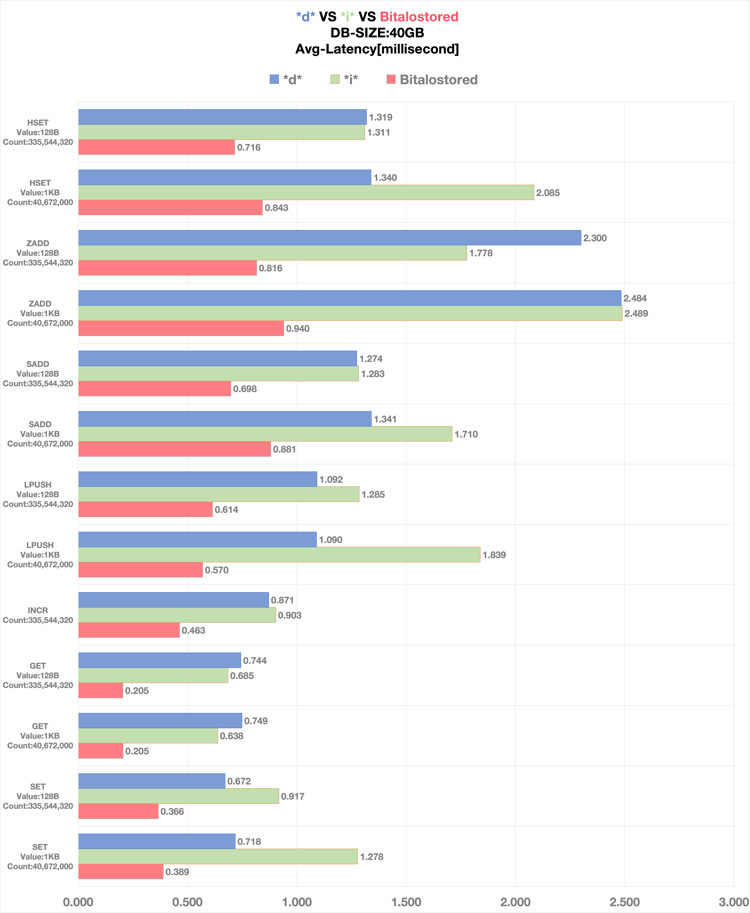

### Bitalostored is a high-performance distributed storage system, compatible with Redis protocol. [中文版](./README_CN.md)

## Introduction

- Bitalostored is a high-performance distributed storage system, core engine based on [bitalosdb](https://github.com/zuoyebang/bitalosdb), compatible with Redis protocol. As an alternative to Redis, it stores data with low-cost hard disk instead of expensive memory, takes full advantage of multi-core and provides excellent single-core performance, which can significantly reduce service costs.

- Bitalostored contains three main projects: dashboard (visual management platform), stored (storage service), and proxy (proxy service). Current open-source version is stable, and provides a complete industrial grade solution. In Zuoyebang company, the stability of Bitalostored has been verified. Hundreds of online clusters are running stably all year round. Now data capacity is 200TB, peak QPS is 20 million, peak network bandwidth is 5000Gbps, and since v1.0 was released in 2019, there have been no online incidents.

## Team

- Produced: Zuoyebang Company - Platform technical team

- Author: Xu Ruibo(hustxrb@163.com)

- Contributors: Xing Fu(wzxingfu@gmail.com), Lu Wenwei(422213023@qq.com), Liu Fang(killcode13@sina.com), Li Jingchen(cokin.lee@outlook.com)

## Key Technology

- Compatible with Redis protocol, low integration cost. Supports most commands, including LUA, distributed transactions.

- High-performance core, equipped with self-developed KV engine: bitalosdb, which has a significant performance breakthrough compared to rocksdb.

- High-performance data consistency architecture, based on bitalos-raft, deeply optimized Raft protocol, significantly improved write performance, and more stable election strategy and data synchronization process.

- High-performance storage structure. By compressing redis composite data structure, greatly reduce disk I/O bytes, and improve system throughput.

- Multi-cloud disaster recovery, supports multi-room or multi-cloud deployment & management, and has a comprehensive complete downgrade & disaster recovery solution.

- Multi-master write (enterprise edition support). Based on CRDT, optimize data synchronization and consistency strategy, ensure that conflicts can be adaptively resolved when written to multi-master in same shard, and guarantee eventual consistency.

## Quick deployment

- Applicable scenarios: Deploy a test cluster on a single machine(machine needs to be connected to the Internet), experience the functions of all components(dashboard, proxy, and stored), and cluster operation and maintenance

- Deployment script: install.sh, follow the prompts to enter the number of shards (group), the number of slave nodes (slave), and the number of witness nodes (witness); the default number: proxy * 1, group * 2 (master * 2, slave * 2 , witness * 2)

- Admin web: 127.0.0.1:8080, both of default user&password are demo

- Service address: 127.0.0.1:8790, use command: redis-cli -h 127.0.0.1 -p 8790

- Uninstall script: uninstall.sh

## Performance

There are currently several well-known open source storage systems (compatible with the redis protocol), two products (\*d\* & \*i\*) with excellent performance are chosen. This benchmark is bases on bitalostored v4.0 and two procudcts (\*d\* & \*i\*) newest version.

### Hardware

```
CPU:    Intel(R) Xeon(R) Platinum 8255C CPU @ 2.50GHz
Memory: 384GB
Disk:   2*3.5TB NVMe SSD
```

### Program

- Benchmark: memtier_benchmark (redis official tool)

- NoSQL Program: thread number(8), cgroup cpu(8 core)

- Command args: 3 data spec

```
--data-size=1024 --key-maximum=30000000 -t 8 -c 16 -n 163840 # items=20971520 (8*16*163840)
--data-size=512--key-maximum=60000000 -t 8 -c 16 -n 327680 # items=41943040 (8*16*327680)
--data-size=128 --key-maximum=200000000 -t 8 -c 16 -n 1310720 # items=167772160 (8*16*1310720)
```

- Command (e.g., --data-size=1024)

```
./memtier_benchmark -t 8 -c 16 -s 127.0.0.1 -p xxxx --distinct-client-seed --command="set __key__ __data__" --key-prefix="kv_" --key-minimum=1 --key-maximum=30000000 --random-data --data-size=1024 -n 163840
./memtier_benchmark -t 8 -c 16 -s 127.0.0.1 -p xxxx --distinct-client-seed --command="get __key__" --key-prefix="kv_" --key-minimum=1 --key-maximum=30000000 --test-time=300
./memtier_benchmark -t 8 -c 16 -s 127.0.0.1 -p xxxx --distinct-client-seed --command="incr __key__" --key-prefix="int_" --key-minimum=1 --key-maximum=200000000 --random-data -n 1310720
./memtier_benchmark -t 8 -c 16 -s 127.0.0.1 -p xxxx --distinct-client-seed --command="lpush __key__ __data__" --key-prefix="list_" --key-minimum=1 --key-maximum=30000000 --random-data --data-size=1024 -n 163840
./memtier_benchmark -t 8 -c 16 -s 127.0.0.1 -p xxxx --distinct-client-seed --command="sadd __key__ __data__" --key-prefix="set_" --key-minimum=1 --key-maximum=30000000 --random-data --data-size=1024 -n 163840
./memtier_benchmark -t 8 -c 16 -s 127.0.0.1 -p xxxx --distinct-client-seed --command="zadd __key__ __key__ __data__" --key-prefix="" --key-minimum=1 --key-maximum=30000000 --random-data --data-size=1024 -n 163840
./memtier_benchmark -t 8 -c 16 -s 127.0.0.1 -p xxxx --distinct-client-seed --command="hset __key__ __data__ __key__" --key-prefix="hash_" --key-minimum=1 --key-maximum=30000000 --random-data --data-size=1024 -n 163840
```

incr is irrelevant to data size, only needs to be tested once.


### Data

- Total data size：20GB

- Comparison dimensions： comand（SET、GET、LPUSH、SADD、ZADD、HSET） x valueSize&count（1KB & 20,971,520、512B & 41,943,040、128B & 167,772,160）, INCR

- Comparison standard: QPS on single-core (multi-core QPS / core number), single-core performance reflects cost advantage better.

### Config

- \*d\* & \*i\*

```
Threads:8
Memtable：512MB
WAL：enable
Binlog：disable
Cache：8GB

Other parameters are set as same as the official recommended benchmark configuration
```

- bitalostored

```
Threads:8
Memtable：512MB
WAL：enable
Raftlog：disable
Cache：disable
```

### Result

- QPS ([Horizontal](./docs/benchmark-qps.png))


- Latency ([Horizontal](./docs/benchmark-latency.png))



## Document

Technical architecture and documentation, refer to the official website: bitalos.zuoyebang.com (Building...)

## Technology accumulation(bitalosearch)

- High performance distributed search & analysis engine, SQL protocol, focusing on AP scenarios, and has certain TP capabilities. It is being practiced internally, and the open source plan is to be determined

- Compared to elasticsearch, bitalosearch has significant cost advantages. Hard disk consumption is saved 30%; data writing performance is improved by 25%; for complex analysis logic, query performance is improved by 20% to 500%